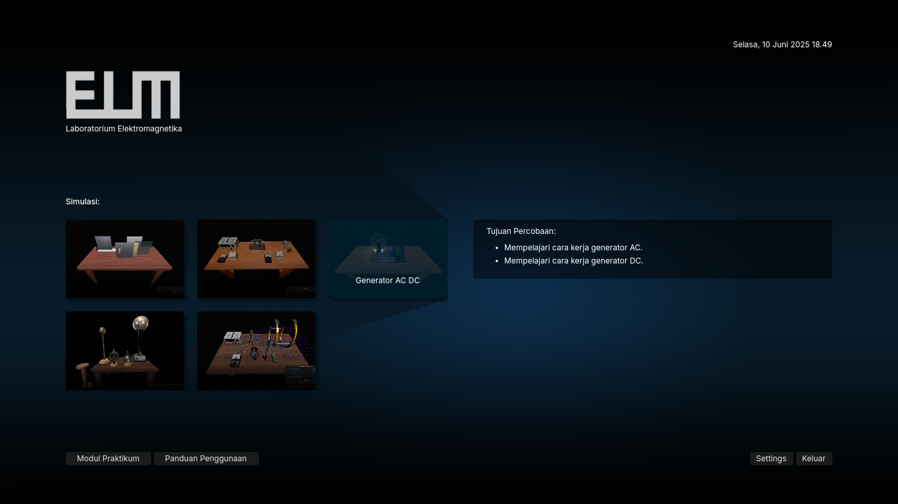
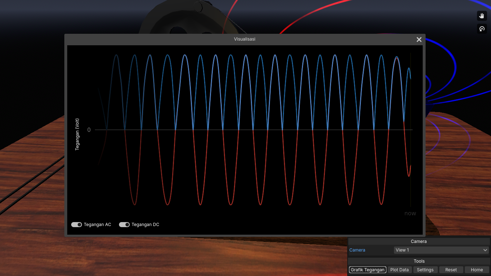
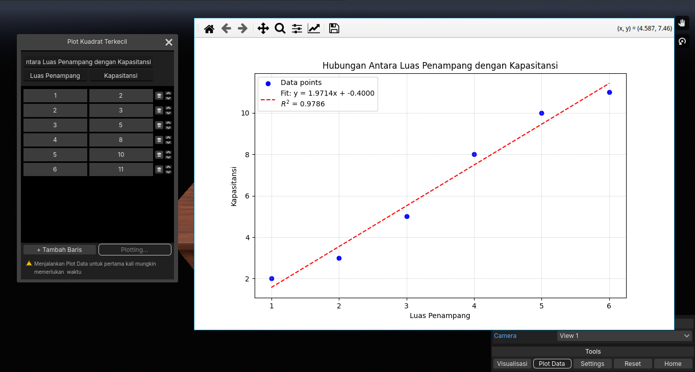
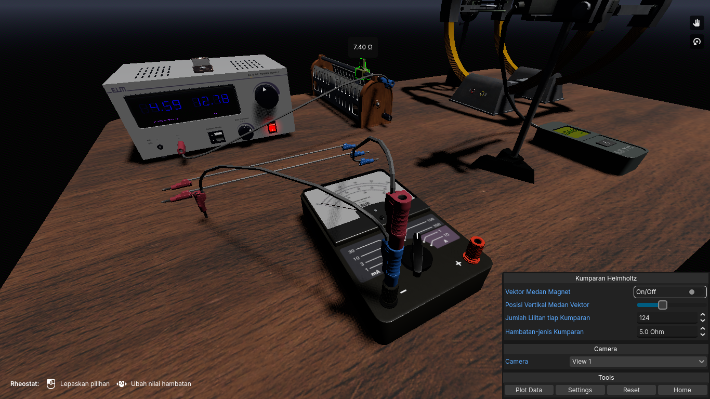

+++
title = "Projects"
[extra]
toc = true
toc_sidebar = true
toc_inline = true
toc_ordered = true
+++

## Elm
> Intentionally Unstable Physics Simulation (for now only electromagnetics). This project is open source under the MIT license, and is registered with IPR.

Due to several reasons, the open-sourcing of Elm has been delayed until early 2026.

Here are some screenshots from Elm.

### Home

### Graph

### Plotter

### Creating Circuit

## LAMBDA
> Yet Antoher AI for E Coming Soon... LAMBDA stand for [L]ambda [A]int [M]ade [b]y [D]umb [A]lgorithm